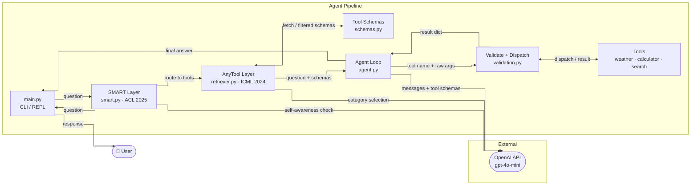

# smart-anytool-agent

A tool-calling agent that implements concepts from two peer-reviewed AI research papers - **SMART** (ACL 2025) and **AnyTool** (ICML 2024) - on top of OpenAI function calling.

Most tool-calling agents dump every available tool at the LLM and hope it picks correctly. This agent does two things differently:

1. **SMART layer** - before calling any tool, the agent asks: "can I already answer this from my own knowledge?" If yes, it answers directly and skips tool calling entirely. Inspired by *SMART: Self-Aware Agent for Tool Overuse Mitigation* (ACL 2025 Findings).

2. **AnyTool layer** - if a tool is needed, the agent does not pass all tools to the LLM at once. It first filters to the relevant tool category, then passes only that subset. If the result is unsatisfactory, a self-reflection loop retries. Inspired by *AnyTool: Self-Reflective, Hierarchical Agents for Large-Scale API Calls* (ICML 2024).

---

## Research Papers

| Paper | Venue | Key Contribution |
| --- | --- | --- |
| [SMART: Self-Aware Agent for Tool Overuse Mitigation](https://arxiv.org/abs/2502.11435) | ACL 2025 Findings | Self-awareness layer that reduces tool calls by 24% while improving accuracy by 37% |
| [AnyTool: Self-Reflective, Hierarchical Agents for Large-Scale API Calls](https://arxiv.org/abs/2402.04253)<br>[GitHub Repository - AnyTool](https://github.com/dyabel/AnyTool) | ICML 2024 | Hierarchical tool filtering + self-reflection loop; outperforms ToolLLM by 35.4% |

---

## Architecture



---

## Setup

```bash
git clone https://github.com/Buffden/smart-anytool-agent
cd smart-anytool-agent

python -m venv venv
source venv/bin/activate  # Windows: venv\Scripts\activate

pip install -r requirements.txt

cp .env.example .env
# Add your OPENAI_API_KEY to .env
```

---

## Usage

```bash
python main.py
```

```text
You: What is 15% of 340?
Agent: [SMART] Answering directly - no tool needed.
       15% of 340 is 51.

You: What is the weather in Tokyo right now?
Agent: [SMART] Tool required - parametric knowledge insufficient.
       [AnyTool] Selected category: weather tools.
       [Tool] get_weather(city=Tokyo, unit=celsius)
       Tokyo is currently 27°C and partly cloudy.

You: What is the latest research on LLM agents?
Agent: [SMART] Tool required - real-time information needed.
       [AnyTool] Selected category: search tools.
       [Tool] web_search(query=latest research LLM agents 2025)
       ...
```

---

## Implementation Plan

| Concept | Source Paper | Status |
| --- | --- | --- |
| Self-awareness before tool calling | SMART (ACL 2025) | [ ] |
| Hierarchical tool filtering | AnyTool (ICML 2024) | [ ] |
| Self-reflection on failure | AnyTool (ICML 2024) | [ ] |
| Tool schemas grouped by category | AnyTool (ICML 2024) | [ ] |
| Agent solver loop | AnyTool (ICML 2024) | [ ] |
| Parallel tool call handling | AnyTool (ICML 2024) | [ ] |
| Real-world API tools (weather, search) | AnyTool (ICML 2024) | [ ] |
| Safe expression evaluation | Engineering best practice | [ ] |
| Pydantic argument validation + dispatch | Engineering best practice | [ ] |
| CLI entry point | Project infrastructure | [ ] |

---

## Stack

- Python 3.12
- OpenAI API (`gpt-4o-mini`)
- Pydantic - argument validation
- httpx - async HTTP for weather API
- duckduckgo-search - web search, no API key required
- Open-Meteo API - weather, no API key required

---

## References

This project is a hands-on implementation of concepts from the following peer-reviewed papers. If you use or build on this work, please consider citing them.

```bibtex
@inproceedings{smart2025,
  title     = {SMART: Self-Aware Agent for Tool Overuse Mitigation},
  booktitle = {Findings of ACL 2025},
  year      = {2025},
  url       = {https://arxiv.org/abs/2502.11435}
}

@inproceedings{anytool2024,
  title     = {AnyTool: Self-Reflective, Hierarchical Agents for Large-Scale API Calls},
  booktitle = {ICML 2024},
  year      = {2024},
  url       = {https://arxiv.org/abs/2402.04253}
}
```
